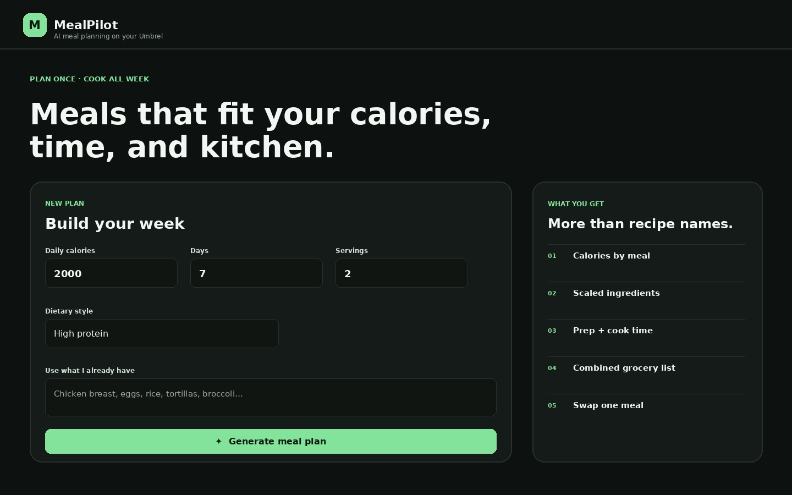
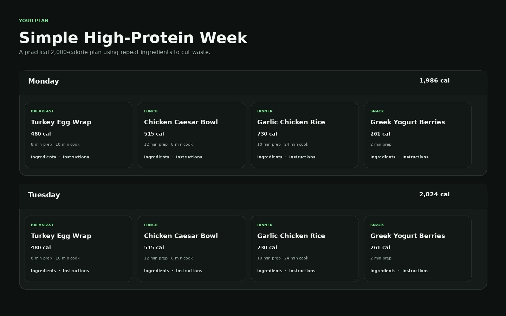
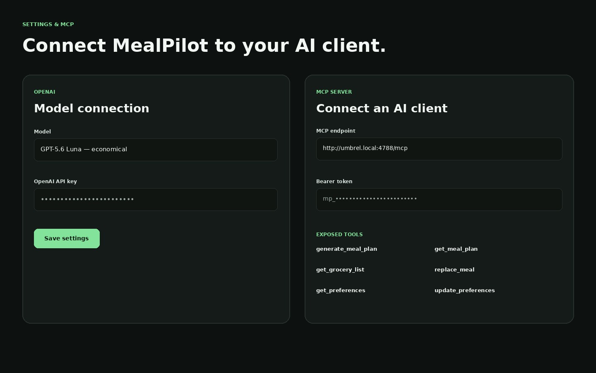

# MealPilot for Umbrel

MealPilot is a self-hosted AI meal planner built for umbrelOS. It generates structured meal plans with:

- calories for every meal and daily calorie totals
- ingredient quantities scaled to household servings
- prep time, cook time, and total time
- cooking instructions
- 1–14 day plans
- dietary style, allergies, dislikes, pantry ingredients, budget guidance, and time limits
- combined grocery lists
- saved plan history in SQLite
- single-meal AI replacement
- an authenticated Streamable HTTP MCP server

The web app calls the OpenAI **Responses API** directly and asks for **strict JSON Schema structured output**, so the UI is rendering validated plan data rather than trying to parse free-form Markdown.

## Screens





## Architecture

```text
Browser / Umbrel UI
       |
       v
+---------------------------+
| Node 22 + Express         |
|                           |
| /api/*                    |
| - settings                |
| - generation              |
| - saved plans             |
| - grocery lists           |
| - replace meal            |
|                           |
| /mcp                      |
| - Streamable HTTP MCP     |
+-------------+-------------+
              |
       +------+------+
       |             |
       v             v
  SQLite /data   OpenAI Responses API
```

The app uses the current split MCP TypeScript SDK (`@modelcontextprotocol/server` + `@modelcontextprotocol/node`) and a stateless Streamable HTTP handler.

## Repository layout

```text
.
├── .github/workflows/publish.yml   # multi-arch GHCR build
├── public/                         # browser UI
│   ├── index.html
│   ├── styles.css
│   ├── app.js
│   └── favicon.svg
├── src/
│   ├── server.js                   # Express/API entrypoint
│   ├── db.js                       # SQLite persistence
│   ├── meal-plan.js                # schemas + grocery logic
│   ├── openai.js                   # Responses API integration
│   └── mcp.js                      # MCP server + bearer auth
├── tests/meal-plan.test.js
├── soggyhammy-mealpilot/           # Umbrel community-store listing
│   ├── docker-compose.yml
│   ├── umbrel-app.yml
│   ├── icon.png
│   └── 1.jpg / 2.jpg / 3.jpg
├── umbrel-app-store.yml
├── Dockerfile
├── docker-compose.local.yml
└── package.json
```

## Quick local test

You only need Docker:

```bash
git clone https://github.com/SoggyHammyDev/mealpilot.git
cd mealpilot
docker compose -f docker-compose.local.yml up --build
```

Open:

```text
http://localhost:3000
```

Then go to **Settings**, enter an OpenAI API key, select a model, and click **Test connection**.

You can also inject the key instead of saving it in SQLite:

```yaml
environment:
  OPENAI_API_KEY: "sk-..."
```

An environment key takes priority over a key entered in the UI.

## OpenAI models

The UI ships with these presets:

- `gpt-5.6-luna` — default; cost-sensitive meal generation
- `gpt-5.6-terra` — stronger balance of intelligence and cost
- `gpt-5.6-sol` — highest-quality preset

The model setting is persisted locally. MealPilot sends `store: false` in Responses API calls.

## Build and publish the Docker image

The Umbrel definition currently points to:

```text
ghcr.io/soggyhammydev/mealpilot:0.1.0
```

The included GitHub Action builds both `linux/amd64` and `linux/arm64`.

After pushing this repository to GitHub, create the first release tag:

```bash
git tag v0.1.0
git push origin v0.1.0
```

The workflow publishes `ghcr.io/<repository-owner>/mealpilot:0.1.0`.

If the repository owner is not `SoggyHammyDev`, edit the image line in:

```text
soggyhammy-mealpilot/docker-compose.yml
```

For Umbrel to pull the image without registry credentials, make the GHCR package public.

## Install as an Umbrel Community App Store

This repository is already laid out as a community app store:

```yaml
id: "soggyhammy"
name: "SoggyHammy Apps"
```

The app ID is correspondingly prefixed:

```text
soggyhammy-mealpilot
```

After the image exists in GHCR:

1. Push this full repo to GitHub.
2. In umbrelOS, open the App Store / Community App Store settings.
3. Add the GitHub repository URL.
4. Refresh the store.
5. Install **MealPilot**.
6. Open MealPilot → **Settings** → enter your OpenAI API key.

The app stores persistent state under Umbrel's `${APP_DATA_DIR}/data` mount.

## MCP endpoint

MealPilot exposes MCP at:

```text
http://<your-umbrel-host>:4788/mcp
```

The exact endpoint and bearer token are shown inside **Settings → MCP Server**.

Every MCP request must include:

```http
Authorization: Bearer mp_your_token_here
```

The token is generated on first startup and stored at:

```text
/data/mcp-token.txt
```

You can rotate it from the UI. Token comparison uses a constant-time check.

### MCP tools

#### `generate_meal_plan`

Generate and save a new plan. Optional inputs include:

- `days`
- `calorieTarget`
- `servings`
- `startDate`
- `dietaryStyle`
- `allergies`
- `avoidFoods`
- `pantry`
- `maxTotalMinutes`
- `budget`
- `customInstructions`

#### `list_meal_plans`

List recent saved plans and their IDs.

#### `get_meal_plan`

Read the full stored plan by `planId`.

#### `get_grocery_list`

Return combined ingredient quantities for a saved plan.

#### `replace_meal`

Replace one `mealId` inside a saved plan. MealPilot asks OpenAI for a replacement that keeps that day close to the original calorie target.

#### `get_preferences`

Read MealPilot's non-secret preferences. The OpenAI API key is never returned.

#### `update_preferences`

Update meal-planning preferences. It cannot modify the OpenAI API key.

## Example MCP request

A compatible client handles MCP negotiation for you. For a raw connectivity check, send an MCP request with the token and accept both JSON and SSE response types as required by the protocol/client version.

The server uses the 2026 MCP HTTP handler and also retains the SDK's stateless compatibility path for 2025-era clients.

## ChatGPT-specific note

MealPilot itself is ready for remote MCP clients, but ChatGPT does **not** directly connect to an MCP server that is only reachable on your LAN. A private Umbrel endpoint needs a supported secure tunnel or another safe remote-access path.

ChatGPT plan/workspace availability also controls which custom MCP capabilities can be enabled. None of that blocks MealPilot's built-in web UI: the normal Generate button talks to the OpenAI API directly.

## REST API

Useful endpoints:

```text
GET    /api/health
GET    /api/settings
PUT    /api/settings
PUT    /api/settings/openai-key
DELETE /api/settings/openai-key
POST   /api/settings/test-openai
GET    /api/mcp-config
POST   /api/mcp-config/rotate-token
POST   /api/generate
GET    /api/plans
GET    /api/plans/:id
DELETE /api/plans/:id
GET    /api/plans/:id/grocery-list
POST   /api/plans/:id/meals/:mealId/replace
```

## Data model

SQLite contains two tables:

- `settings` — planning settings and optional stored OpenAI key
- `plans` — one JSON document per saved meal plan plus searchable summary columns

SQLite runs in WAL mode.

### Secret handling

- REST `GET /api/settings` never returns the API key.
- MCP `get_preferences` never returns the API key.
- The MCP token is available only through the Umbrel-authenticated settings API/UI and its file inside the app data directory.
- The `/mcp` route is whitelisted from Umbrel login specifically so machine MCP clients can reach it; MealPilot applies its own bearer-token gate there.
- API keys stored through the UI are stored locally in SQLite. If you prefer not to persist the key in the database, inject `OPENAI_API_KEY` through the container environment instead.

## Tests

The pure meal-plan logic has Node's built-in test coverage:

```bash
npm test
npm run check
```

Tests currently cover:

- bounds and preference sanitization
- grocery aggregation
- daily calorie/time recalculation
- JavaScript syntax checks

## Nutrition disclaimer

MealPilot's calorie values and ingredient nutrition are AI-generated estimates, not laboratory measurements or medical advice. For allergies, ingredient labels and manufacturer information should be treated as authoritative. The generator prompt treats entered allergies as hard exclusions, but users should still verify the final ingredients themselves.

## Versioning

Current version: **0.1.0**

Suggested next releases:

- **0.2.0** — macros and per-day protein targets
- **0.3.0** — pantry inventory and leftover tracking
- **0.4.0** — recipe favorites / locked meals
- **0.5.0** — estimated grocery pricing providers

## License

MIT
